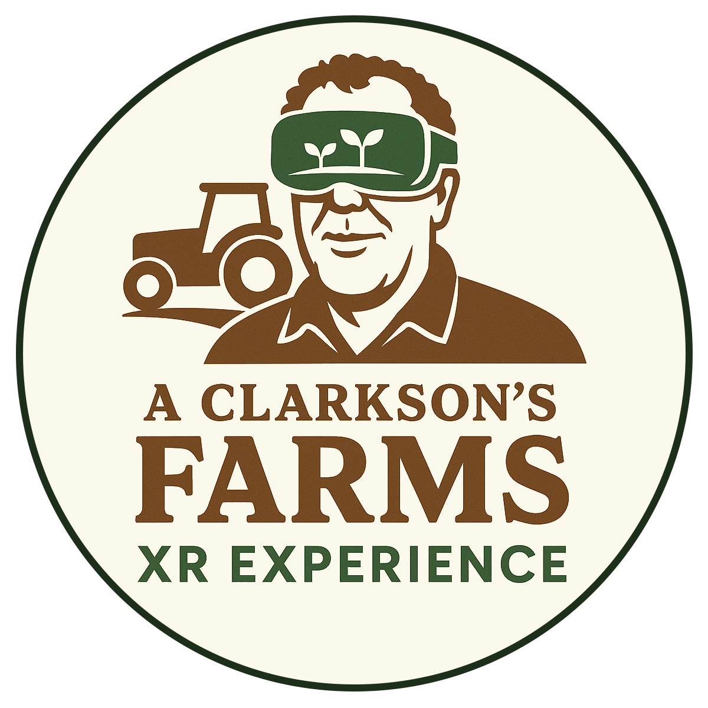
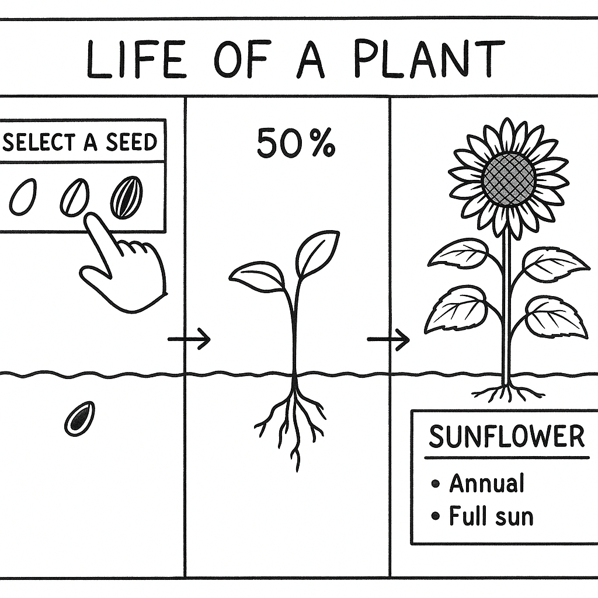
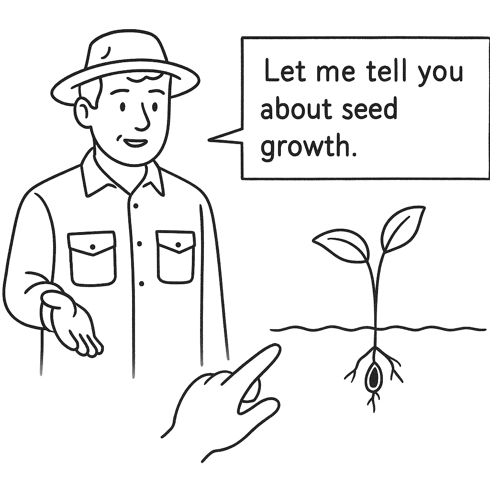

# **CA PROPOSAL**: SDGS #15 – LIFE ON LAND

## “A Clarkson’s Farms Experience”

 - By C21381381 – **Eduard Dravnieks**
 - By C21415142 – **César Hannin**

> XR – Prototyping CMPU4030
> October 2025

#### Table of Contents

- [Summary](#summary)
- [Features](#features)
  - [Life of a Plant](#life-of-a-plant)
  - [Mentor](#mentor)
  - [Explaining items of interest](#3-explaining-items-of-interest)
  - [Soil](#31-soil)
  - [Weather classes](#32-weather-classes)
  - [Plant Growth + Score](#33-plant-growth--score)
  - [Emissions](#34-emissions)
  - [Economy](#35-economy)
- [Contact Us](#contact-us)

# Summary

While watching Jeremy Clarkson on his hit TV show *“Clarkson’s Farms”*, you have several different aspects of farming shown and explained to you while still being entertaining, aspects which I think most people would never have thought about, such as the financial aspects, the impact of unpredictable weather, and even legal processes that farmers have to contend with. 

We propose a **“Hands-on XR farming simulator”** where players learn soil basics, weather impacts, biodiversity, Animal caretaking, and sustainable practices. It’s hoped that the experience will resemble being on an interactive episode of Clarkson’s farm, where users learn the basics about how to be a farmer and hopefully inspire them to pursue it as a career path, as more farmers are needed in todays’ age, and it’s something that isn’t talked about or glamorised as much as it should be!

# Features

 ## 1. Life of a Plant
The player will choose a seed *(melon seed for example)*, they’ll choose what type of soil to plant it in, and after it’s been planted time will speed up, and the player could see how the weather has impacted its development over this time, all the while the player will see it grow right in front of them. 
The player will have to do actions like: 

 - ploughing the bed
 - watering
 - manually pulling up and inspecting the crop
 
 And more!

Players will also have the option to just simply watch the plant grow right in front of them *(sped up)*. 
We will have examples of where the user can find some of these plants in real life so that they may see and feel them in person. 
For the scope and purposes of this project, we will focus on the TUD – Grangegorman garden and flora and the plants that can be found there.

## 2. Mentor
There will be a hologram who will talk with the user, explaining different concepts, maybe something that requires a bit of explanation, all with accompanying subtitles. 
It would be nice if we could Jermy Clarkson’s likeness as this **“mentor”** NPC and have his voice explaining and guiding the player.

## 3. Explaining items of interest

Farming involves knowledge and consideration for several different aspects of the process. It is belief that they’re all equally important and require to be mentioned.

### 3.1 Soil
Different Soil classes with different **textures** *(sand/silt/clay)*, **pH**, **SOM**, **density**, all of which could affect available **water**, **nutrient mobility**, and other aspects.

### 3.2 Weather Classes
**Temperature**, **rain**, **wind**, **radiation**, or events like **frost**, **heatwave**, **storms** could all have impact on the soil.

### 3.3 Plant Growth + Score
Affected by **heat**, **water stress**, and **nutrients**. Will also have different growth stages and yields. 
A score can also be assigned here to the player depending on how they looked after this crop. 
Like the game [Cooking Mama](https://en.wikipedia.org/wiki/Cooking_Mama) but for farming.

### 3.4 Emissions
Could show **fuel** and **resources** used and required in relation to yield. 
Maybe show what it’s like in different countries with at different stages of development. 
Could help put into perspective the greenhouse effect.

### 3.5 Economy
Show costs of **seed**, **fertiliser**, **tools**, etc, and the revenue generated. 
We could also show legal issues and other dangers that farmers face which could help put a lot of this into perspective.

# Contact us

Our emails are:
 - C21381381@mytudublin.ie
 - C21415142@mytudublin.ie

